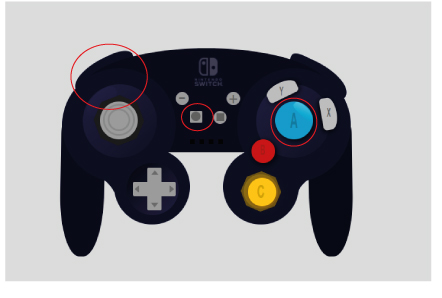

# Mando de estilo GameCube para videoconsola Nintendo Switch
Abrir index.html en el navegador. 
 Los botones con los que se puede interctuar son:
 

 Fuentes:
 Logotipo: https://www.pikpng.com/pngvi/iJJTomm_nintendo-switch-console-microsoft-etherborn-altered-nintendo-switch-logo-white-clipart/